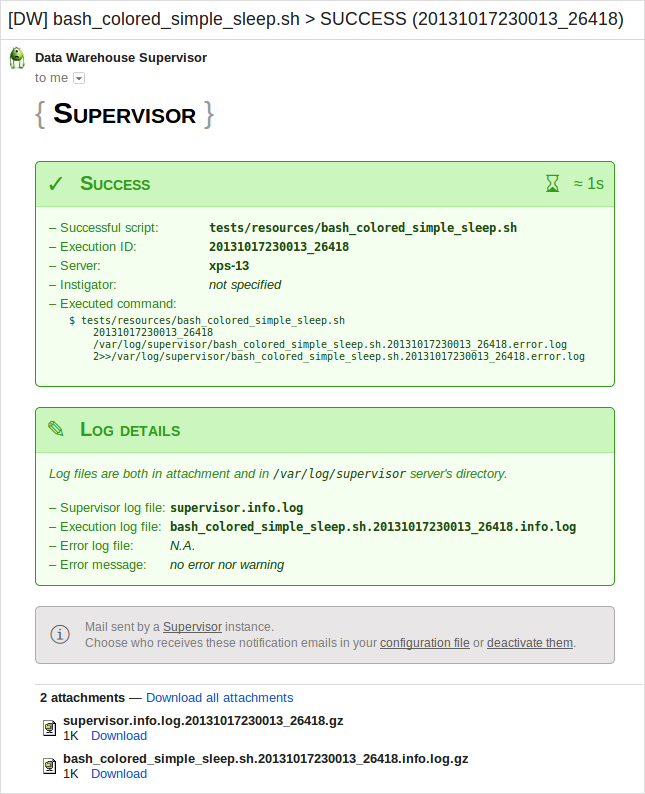
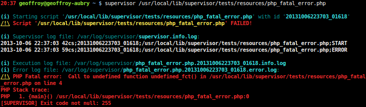
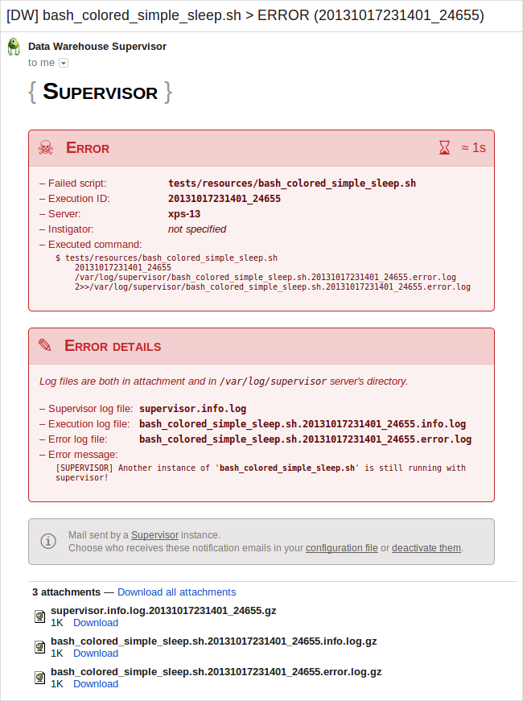

# Supervisor

[](https://packagist.org/packages/geoffroy-aubry/Supervisor)
[](http://travis-ci.org/geoffroy-aubry/Supervisor)
&nbsp;_[Estimated code coverage](https://travis-ci.org/geoffroy-aubry/Supervisor): 88% (503 of 572 lines)._

Oversee script execution, recording `stdout`, `stderr` and exit code with timestamping,
and ensure email notifications will be sent (on startup, success, warning or error)… plus many other features.

*Technologies* : Supervisor is in Bash, only unit tests are in PHP.

## Table of Contents

  * [Features](#features)
    * [General](#general)
    * [Notifications](#notifications)
    * [Ergonomics](#ergonomics)
    * [Code quality](#code-quality)
  * [Requirements](#requirements)
  * [Usage](#usage)
    * [Help on command prompt](#help-on-command-prompt)
    * [Exit status](#exit-status)
    * [Successful execution](#successful-execution)
    * [Errors](#errors)
    * [Tags](#tags)
    * [Locks](#locks)
    * [Customized mails](#customized-mails)
    * [Supervisor supervised](#supervisor-supervised)
    * [Archiving](#archiving)
    * [Monitoring](#monitoring)
    * [Summary](#summary)
  * [Installation](#installation)
  * [Copyrights & licensing](#copyrights--licensing)
  * [Change log](#change-log)
  * [Continuous integration](#continuous-integration)
  * [Git branching model](#git-branching-model)

## Features

### General

  * Oversee script execution, recording `stdout`, `stderr` and exit code
  * Prefix each line of `stdout` with timestamps with hundredths of seconds.
  * An execution ID uniquely identify each script execution.
    Used in: `supervisor.info.log`, `supervisor.error.log`, `<script>_<exec_id>.info.log`
    and `<script>_<exec_id>.error.log`.
  * Possibility to block parallel overseen script execution. Useful if an execution takes too long…
  * You can specify a configuration file to load in addition to the default one.
  * Entirely configurable tag system allowing executed scripts to dynamically specify via `stdout`
    warning, mailto, mail attachment, instigator…
  * Automatic log archiving mechanism.
  * Display a summary of supervisor's activity during last days,
    including final status per day and per supervised script.
  * Handle CSV output, with definition of field separator, field enclosure and number of the field to watch
    in configuration file.

### Notifications

  * Ensure email notifications will be sent on following events (configurable): startup, success, warning or error.
    Catch exit code, fatal error, exceptions…
  * All mail contains content of `stdout` and `stderr` of executed script in Gzip attachment.
  * Mails are fully customizable. Just provide your file on command line.
  * Possibility to inject multiple external parameters on command line into customized emails.
  * Supervisor itself is monitoring by another process,
    sending critical email notifications using an exponential backoff algorithm in minute increments.

### Ergonomics

  * During supervision and in addition of all log files, Supervisor displays in real time outputs, warning and errors
    of overseen script, adding timestamp and respecting both colors and indentation.
    Name of all log files are printed too.

### Code quality

  * Bash code executed with following directives:
    * `set -o nounset`: treat unset variables and parameters other than the special parameters `@` or `*` as an error
       when performing parameter expansion. An error message will be written to the standard error,
       and a non-interactive shell will exit.
    * `set -o pipefail`: The return value of a pipeline is the value of the last (rightmost) command to exit
       with a non-zero status, or zero if all commands in the pipeline exit successfully.
  * A lot of unit tests (via [PHPUnit](https://github.com/sebastianbergmann/phpunit/) through a PHP wrapper)
    covering almost the whole application.

## Requirements

  - Bash v4 _(2009)_ and above
  - [mutt](http://www.mutt.org/), to send email notifications
  - Unit tests require PHP >= 5.3.3

Tested on Debian/Ubuntu Linux.

## Usage

### Help on command prompt

Displayed by:

```bash
$ supervisor.sh [-h|--help]
```


##### Text version

    Description
        Oversee script execution, recording stdout, stderr and exit code with timestamping,
        and ensure email notifications will be sent (on start, success, warning or error).

    Usage
        supervisor.sh [OPTION]… <script-path> [<script-parameters>]
        supervisor.sh [-c <conf-file>] --archive=<min-days>
        supervisor.sh [-c <conf-file>] --monitor
        supervisor.sh [-c <conf-file>] --summarize

    Options
        --archive=<min-days>
            Archive in Gzip supervisor's logs older than <min-days>.

        -c <conf-file>, --conf=<conf-file>
            Specify a configuration file to load in addition to the default one.

        --customized-mails=<file>
            Path to a Bash script customizing sent mails by redefining some of
            the sendMailOn[Init|Success|Warning|Error]() functions.
            See --param option.

        -h, --help
            Display this help.

        --mail-instigator=<email>
            Specify who executed the supervisor.

        --mail-to=<email>
            Add a new recipient's email address. Multiple --mail-to options may be used.

        --monitor
            Check whether supervisor's error log file is empty. If not, then send critical
            email notifications using an exponential backoff algorithm in minute increments.
            Typically called every minute with a cron job:
                * * * * * <user> /path/to/supervisor.sh --conf=<conf-file> --monitor

        -p <key>=<value>, --param=<key>=<value>
            Allow to inject multiple external parameters into customized emails.
            Assign the value <value> to the Bash variable $EXT_<key>.
            See --customized-mails option.

        --summarize=<max-nb-days>
            Display a summary of supervisor's activity during last <max-nb-days> days,
            including final status per day and per supervised script.
            Also send this summary by email.

        <script-path>
            Executable script to oversee.

        <script-parameters>
            Optional oversaw script's parameters.

    Exit status
          0 if and only if no error
         65 Missing script name!
         66 Script '…' not found!
         67 Script '…' is not executable!
         68 Exit code changed from 0 to 68 due to errors.
         69 Another instance of '…' is still running with supervisor!
         71 Customized mails file not found: '…'
         72 Invalid Mutt command: '…'
        xxx Any code not null returned by user script

### Exit status

List of exit status:

  * `0` If and only if no error
  * `65` Missing script name!
  * `66` Script '…' not found!
  * `67` Script '…' is not executable!
  * `68` Exit code changed from 0 to 68 due to errors.
  * `69` Another instance of '…' is still running with supervisor!
  * `71` Customized mails file not found: '…'
  * `72` Invalid Mutt command: '…'
  * Any code not null returned by user script

### Successful execution

An execution is successful if and only if `stderr` is empty, exit status is `0` and there are no warnings.

A short example, here in Bash but no matter the language:

```bash
#!/usr/bin/env bash

echo Title:
echo -e '\033[0;30m┆\033[0m   \033[1;32mgreen level 1'
echo -e '\033[0;30m┆\033[0m   \033[0;30m┆\033[0m   \033[1;33myellow level 2'
echo 'END'
```

Output:


If `SUPERVISOR_MAIL_SEND_ON_STARTUP` is set to `1` in configuration file:


Note that Supervisor add two parameters in addition of script parameters:
  * a unique execution ID
  * name of file recording script's `stderr`

If `SUPERVISOR_MAIL_SEND_ON_SUCCESS` is set to `1` in configuration file:



Content of `supervisor.info.log.20131006223705_01765.gz` attachment:

```
2013-10-06 22:37:05 58cs;20131006223705_01765;/usr/local/lib/supervisor/tests/resources/bash_colored_simple.sh;START
2013-10-06 22:37:05 78cs;20131006223705_01765;/usr/local/lib/supervisor/tests/resources/bash_colored_simple.sh;OK
```

Content of `bash_colored_simple.sh.20131006223705_01765.info.log.gz` attachment:

```
2013-10-06 22:37:05 58cs;[SUPERVISOR] START
2013-10-06 22:37:05 74cs;Title:
2013-10-06 22:37:05 75cs;┆   green level 1
2013-10-06 22:37:05 76cs;┆   ┆   yellow level 2
2013-10-06 22:37:05 77cs;END
2013-10-06 22:37:05 78cs;[SUPERVISOR] OK
```

Note that colors are stripped but indentation is kept.

### Errors

An execution end in error status if either `stderr` is not empty or if exit status is different from `0`.

#### PHP fatal error

We will oversee a PHP script throwing a fatal error:

```php
<?php

undefined_fct();
```

Output:



If `SUPERVISOR_MAIL_SEND_ON_ERROR` is set to `1` in configuration file:


Content of `supervisor.info.log.20131006223703_01618.gz` attachment:

```
2013-10-06 22:37:03 42cs;20131006223703_01618;/usr/local/lib/supervisor/tests/resources/php_fatal_error.php;START
2013-10-06 22:37:03 59cs;20131006223703_01618;/usr/local/lib/supervisor/tests/resources/php_fatal_error.php;ERROR
```

Content of `php_fatal_error.php.20131006223703_01618.info.log.gz` attachment:

```
2013-10-06 22:37:03 42cs;[SUPERVISOR] START
2013-10-06 22:37:03 59cs;[SUPERVISOR] ERROR
```

Content of `php_fatal_error.php.20131006223703_01618.error.log.gz` attachment:

```
PHP Fatal error:  Call to undefined function undefined_fct() in /usr/local/lib/supervisor/tests/resources/php_fatal_error.php on line 4
PHP Stack trace:
PHP   1. {main}() /usr/local/lib/supervisor/tests/resources/php_fatal_error.php:0
[SUPERVISOR] Exit code not null: 255
```

#### Other errors

Similarly, scripts provided below end with an error status.

It should be noted that when `stderr` is not-empty while exit status is `0`,
then Supervisor change exit status from `0` to `68` (see [Exit status](#exit-status)).

##### PHP notice

Content of `tests/resources/php_notice.php`:

```php
<?php

$a = $b;
```

Result in `php_notice.php.[…].error.log.gz` attachment:

```
PHP Notice:  Undefined variable: b in /usr/local/lib/supervisor/tests/resources/php_notice.php on line 4
PHP Stack trace:
PHP   1. {main}() /usr/local/lib/supervisor/tests/resources/php_notice.php:0
[SUPERVISOR] Exit code changed from 0 to 68 due to errors.
```

##### PHP exception

Content of `tests/resources/php_exception.php`:

```php
<?php

throw new RuntimeException("It's an error!\n", 42);
```

Result in `php_exception.php.[…].error.log.gz` attachment:

```
PHP Fatal error:  Uncaught exception 'RuntimeException' with message 'It's an error!
' in /usr/local/lib/supervisor/tests/resources/php_exception.php:4
Stack trace:
#0 {main}
  thrown in /usr/local/lib/supervisor/tests/resources/php_exception.php on line 4
[SUPERVISOR] Exit code not null: 255
```

##### PHP stderr

Content of `tests/resources/php_stderr.php`:

```php
<?php

// file_put_contents('php://stderr', "It's an error!\n");
// or:
fwrite(STDERR, "It's an error!\n");
```

Result in `php_stderr.php.[…].error.log.gz` attachment:

```
It's an error!
[SUPERVISOR] Exit code changed from 0 to 68 due to errors.
```

##### Exit not null

Content of `tests/resources/bash_exit_not_null.sh`:

```bash
#!/usr/bin/env bash

exit 42
```

Result in `bash_exit_not_null.sh.[…].error.log.gz` attachment:

```
[SUPERVISOR] Exit code not null: 42
```

### Tags

Tags allow user scripts to send some information to supervisor.

Tags are strings between square brackets —for example: `[warning]`— used in output of supervised scripts.
Tags must be at the beginning of a line or only preceded by tabulations —defined by `SUPERVISOR_LOG_TABULATION`— or spaces.
A tag concerns all the line.

#### Warnings

If a successful executed script contains warning tags in its output,
then its status will be changed from **Success** to **Warning**.

Default configuration: `SUPERVISOR_WARNING_TAG='[WARNING]'`.

If `SUPERVISOR_MAIL_SEND_ON_WARNING` is set to `1` in configuration file:


Please note that warnings are listed with 2 lines of context.

#### Debug traces

Messages preceded by a debug tag are hidden in Supervisor's output, but still present in `<script>_<exec_id>.info.log`.

Default configuration: `SUPERVISOR_DEBUG_TAG='[DEBUG]'`

_TO DOCUMENT_

#### E-mail related tags

Default configuration:

```
SUPERVISOR_MAILTO_TAG='[MAILTO]'
SUPERVISOR_MAIL_ATTACHMENT_TAG='[MAIL_ATTACHMENT]'
```

_TO DOCUMENT_

### Locks

Sometimes there's the need to ensure that a script is only executed one time.
In order to achieve this, set `SUPERVISOR_LOCK_SCRIPT` to 1 in your configuration file.

```bash
# Lock script against parallel run (0|1)
SUPERVISOR_LOCK_SCRIPT=1
```

Example of output:


Example of sent mail:



### Customized mails

_TO DOCUMENT_

### Supervisor supervised

_TO DOCUMENT_

### Archiving

Archive in Gzip format all supervisor's logs older than `<min-days>`.


### Monitoring

Check whether supervisor's error log file is empty. If not, then send critical
email notifications using an exponential backoff algorithm in minute increments.
Files `supervisor.info.log` and `supervisor.error.log` will be attached in Gzip format.

Typically called every minute with a cron job:
```
* * * * * <user> /path/to/supervisor.sh --conf=<conf-file> --monitor
```

Mail generated through unit tests:


### Summary

Display a summary of supervisor's activity during last `<max-nb-days>` days,
including final status per day and per supervised script.
Also send this summary by email to `SUPERVISOR_MAIL_TO` list.


## Installation

1. Move to the directory where you wish to store the source and clone the repository:

    ```bash
    $ git clone https://github.com/geoffroy-aubry/Supervisor.git
    ```

2. You should be on `stable` branch. If not, switch your clone to that branch:

    ```bash
    $ cd Supervisor && git checkout stable
    ```

3. If you have to supervise scripts producing CSV output,
   then install [Awk CSV parser](https://github.com/geoffroy-aubry/awk-csv-parser) component:
    * Manually:
        * See [Installation section](https://github.com/geoffroy-aubry/awk-csv-parser#installation)
          of Awk CSV parser's `README.md`.

        * Then update `SUPERVISOR_CSV_PARSER` constant in `/conf/supervisor.sh`:

            ```bash
            SUPERVISOR_CSV_PARSER="/path/to/csv-parser.awk"
            ```
    * Via [composer](http://getcomposer.org) *(require PHP >= 5.3.3)*:

        ```bash
        $ composer install
        # or
        $ php composer.phar install
        ```

        *See <http://getcomposer.org/doc/00-intro.md#installation-nix> for more information to install composer.*

4. You can create a symlink to `supervisor.sh`:

    ```bash
    $ sudo ln -s /path/to/src/supervisor.sh /usr/local/bin/supervisor
    ```

It's ready for use:

```bash
$ supervisor --help
```

## Copyrights & licensing

Licensed under the GNU Lesser General Public License v3 (LGPL version 3).
See [LICENSE](LICENSE) file for details.

## Change log

See [CHANGELOG](CHANGELOG.md) file for details.

## Continuous integration

[](http://travis-ci.org/geoffroy-aubry/Supervisor)
&nbsp;_[Estimated code coverage](https://travis-ci.org/geoffroy-aubry/Supervisor): 88% (503 of 572 lines)._

Unit tests with [PHPUnit](https://github.com/sebastianbergmann/phpunit/):

```bash
$ vendor/bin/phpunit --configuration conf/phpunit-dist.xml
```

## Git branching model

The git branching model used for development is the one described and assisted
by `twgit` tool: [https://github.com/Twenga/twgit](https://github.com/Twenga/twgit).
